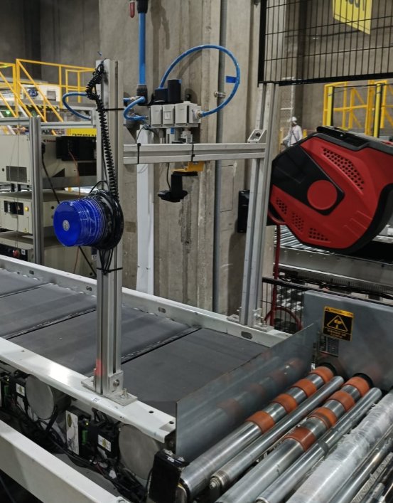
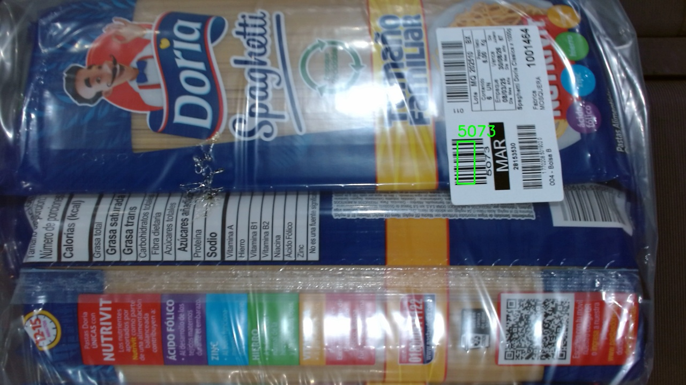

# 📦 Sistema de Verificación de Productos con Raspberry Pi

Proyecto desarrollado para la detección de producto truncado con visión por computadora, automatización industrial y programación con Python. Este sistema permite validar productos mediante códigos de barras en tiempo real usando una Raspberry Pi, una cámara y un sistema de alertas físicas (GPIO).

---

## 🎯 Objetivo del Proyecto

Diseñar un sistema automatizado que detecte productos a través de visión artificial y valide su código de barras. Si el producto no tiene código o es incorrecto, se activa una alarma visual o sonora y se captura evidencia fotográfica.

---

## 🧠 Habilidades Desarrolladas

- Procesamiento de imágenes con OpenCV
- Detección y decodificación de códigos de barras (CODE128) con Pyzbar
- Programación con Python orientada a hardware (GPIO)
- Captura y gestión de archivos multimedia
- Control de procesos con hilos (`threading`)
- Optimización de rendimiento en tiempo real

---

## 🛠 Tecnologías Utilizadas

| Herramienta      | Uso principal                            |
|------------------|------------------------------------------|
| Python 3         | Lenguaje de programación principal       |
| OpenCV           | Procesamiento y análisis de imágenes     |
| Pyzbar           | Lectura de códigos de barras             |
| RPi.GPIO         | Control de pines GPIO en Raspberry Pi    |
| Raspberry Pi OS  | Sistema operativo para ejecución embebida|

---

## 🖼 Funcionamiento General

1. La cámara detecta si hay un producto presente en la imagen.
2. Si hay producto, se busca un código de barras de tipo `CODE128`.
3. El código se compara contra el valor esperado (capturado del sistema de paletizado).
4. Si el código es inválido o no existe:
   - Se activa una alarma (buzzer, luz, etc.) mediante un pin GPIO.
   - Se guarda una imagen del producto para revisión posterior.
5. La alarma puede ser apagada manualmente con la barra espaciadora (confirmar el retiro del producto no correspondiente).

---
# 🔒 Información sensible

Este repositorio no contiene datos privados, archivos de producción, ni credenciales.
El proyecto fue desarrollado para uso interno y privado.

# 📫 Contacto

Para más información técnica o detalles de implementación, puedes comunicarte directamente conmigo.

## 👨‍💻 Autor

Cristian Rivera

